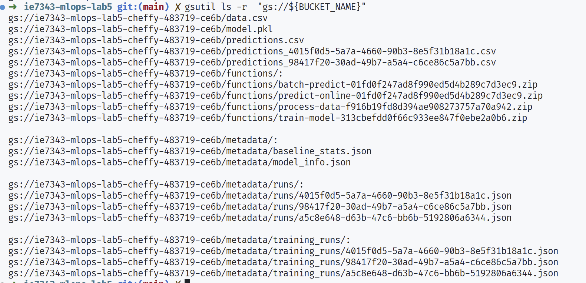
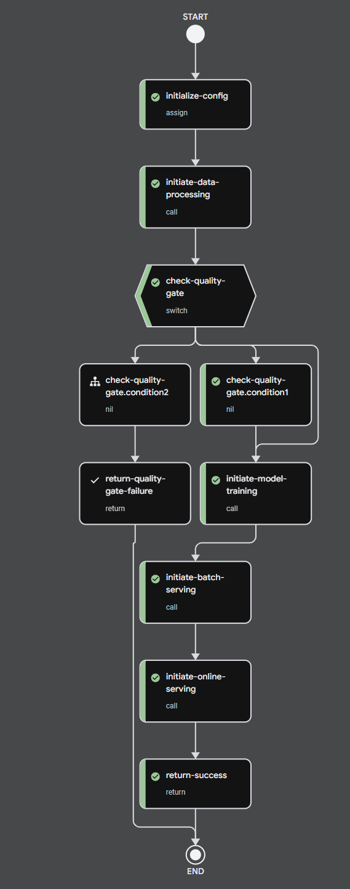
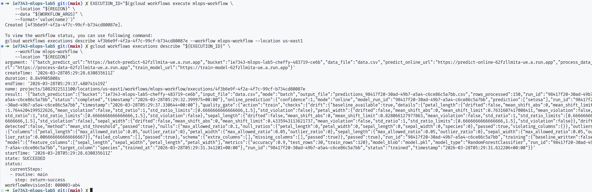
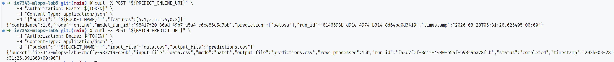

# ie7343-mlops-lab5

- Original lab: `Labs/GCP_Labs/CloudFunction_Labs/Lab2`
- This version adds data quality gating, drift checks, and both online + batch inference as well as terraform deployment with additional security enhancements

## What changed

- Processing now runs quality checks (schema, null ratio, outlier ratio) before training.
- Processing computes simple drift checks using feature mean/std against baseline stats.
- Training is gate-aware: it skips when quality gate fails.
- Training stores metadata and baseline stats in Cloud Storage.
- Serving has two HTTP entrypoints:
    - predict_online for one request at a time.
    - batch_predict for CSV batch scoring.
- Workflow now branches on gate result and returns structured stage outputs.
- Added practical type hints across updated Python modules.
- Added terraform for largely automatic deployment 
- Added private API access and service account for additional security

## Repo layout

Important files:

```text
data/
    data.csv                     # data (same as original)
src/
    data_processing/
        main.py                  # does data quality checks
        requirements.txt
    training/
        main.py                  # does training
        requirements.txt
    serving/
        main.py                  # does inference
        requirements.txt
workflow.yaml
terraform/                       # create GCP resources + Cloud Functions
    main.tf
    variables.tf
    outputs.tf
    terraform.tfvars.example
```

## Terraform setup

Terraform files for resource creation live in terraform.

What it creates:

- Required Google APIs for this lab.
- A storage bucket for data + model artifacts.
- A workflow service account.
- All four HTTP Cloud Functions.

## Run steps

```bash
set -euo pipefail

# 1) Create cloud resources + Cloud Functions with Terraform

cd terraform
cp terraform.tfvars.example terraform.tfvars
# edit terraform.tfvars with your project_id and optional values
terraform init
terraform apply -auto-approve

# 2) Read outputs
PROJECT_ID="$(terraform output -raw project_id)"
REGION="$(terraform output -raw region)"
BUCKET_NAME="$(terraform output -raw bucket_name)"
WORKFLOW_SA="$(terraform output -raw workflow_service_account_email)"
PROCESS_DATA_URI="$(terraform output -raw process_data_uri)"
TRAIN_MODEL_URI="$(terraform output -raw train_model_uri)"
PREDICT_ONLINE_URI="$(terraform output -raw predict_online_uri)"
BATCH_PREDICT_URI="$(terraform output -raw batch_predict_uri)"

gcloud config set project "${PROJECT_ID}"
# Note, if this is a different project, make sure
# your creds are up to date

# 3) Upload dataset
cd ..
gsutil cp data/data.csv "gs://${BUCKET_NAME}/data.csv"

# 4) Deploy workflow with service account (must have permissions to invoke functions)
gcloud workflows deploy mlops-workflow \
    --source workflow.yaml \
    --location "${REGION}" \
    --service-account "${WORKFLOW_SA}"

# 5) Execute workflow with templated URL inputs
WORKFLOW_ARGS="$(cat <<JSON
{
  "process_data_url": "${PROCESS_DATA_URI}",
  "train_model_url": "${TRAIN_MODEL_URI}",
  "batch_predict_url": "${BATCH_PREDICT_URI}",
  "predict_online_url": "${PREDICT_ONLINE_URI}",
  "bucket": "${BUCKET_NAME}",
  "data_file": "data.csv"
}
JSON
)"

EXECUTION_ID="$(gcloud workflows execute mlops-workflow \
    --location "${REGION}" \
    --data "${WORKFLOW_ARGS}" \
    --format='value(name)')"

gcloud workflows executions describe "${EXECUTION_ID}" \
    --workflow mlops-workflow \
    --location "${REGION}"

# 6) Optional direct checks using Terraform function outputs
TOKEN="$(gcloud auth print-identity-token)"

curl -X POST "${PREDICT_ONLINE_URI}" \
    -H "Authorization: Bearer ${TOKEN}" \
    -H "Content-Type: application/json" \
    -d '{"bucket":"'"${BUCKET_NAME}"'","features":[5.1,3.5,1.4,0.2]}'

curl -X POST "${BATCH_PREDICT_URI}" \
    -H "Authorization: Bearer ${TOKEN}" \
    -H "Content-Type: application/json" \
    -d '{"bucket":"'"${BUCKET_NAME}"'","input_file":"data.csv","output_file":"predictions.csv"}'
```

## Expected Outcomes

Bucket contents after successful runs (notice the batch predictions, model bias gates, etc.):



Workflow graph (successful path):



Workflow execution describe output (state: SUCCEEDED):



Authenticated direct API checks (online + batch):




## Artifacts written to GCS

- model.pkl
- metadata/model_info.json
- metadata/baseline_stats.json
- metadata/runs/{run_id}.json
- metadata/training_runs/{run_id}.json

